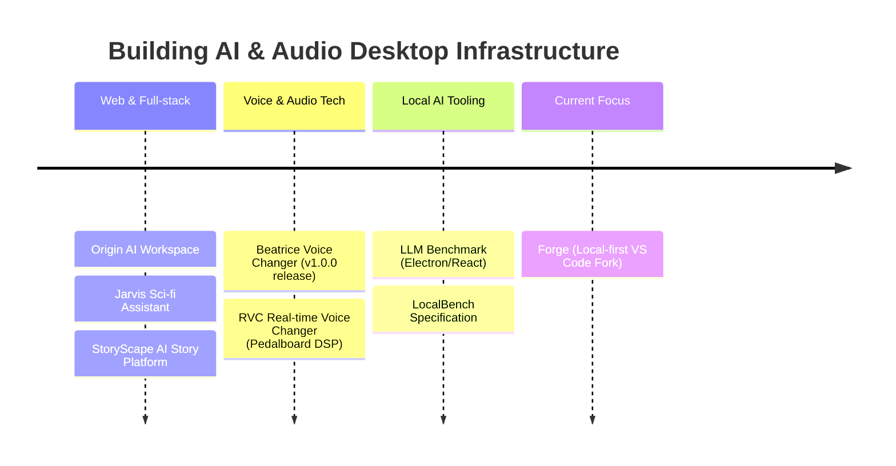

 

---

## 🧭 About me

- 🛠️ Independent developer building **Antigravity** — a suite of interconnected desktop & web apps spanning Electron/React, Python backends, real-time audio DSP, and AI/LLM tooling
- 🎙️ Deep in voice & audio tech: real-time voice conversion, voice changers, TTS pipelines, and low-level DSP engines
- 🤖 Currently building **Forge**, a VS Code fork purpose-built for local LLM inference (Ollama, LM Studio, llama.cpp, vLLM)
- ♟️ Also ship things purely because they're fun — a Stockfish-powered chess app, a Trump-voice TTS dataset experiment
- 🔍 Most projects start as "let me just audit this codebase" and end as a full rewrite with a shipped release

> 🎯 **2026 focus** — shipping **Forge** and building robust agentic integrations for local LLM workflows, making low-latency local inference accessible to everyone. 🚀

---

## 🚀 The journey so far

---

## 📊 Impact, live-counted

---

## 🧱 Featured builds

<table>
<tr>
<td align="center" width="50%">
<a href="https://github.com/satiricalguru/Beatrice-voicechanger">
  <picture>
    <source media="(prefers-color-scheme: dark)" srcset="https://socialify.git.ci/satiricalguru/Beatrice-voicechanger/image?description=1&font=Inter&language=1&name=1&owner=1&pattern=Plus&stargazers=1&theme=Dark">
    <source media="(prefers-color-scheme: light)" srcset="https://socialify.git.ci/satiricalguru/Beatrice-voicechanger/image?description=1&font=Inter&language=1&name=1&owner=1&pattern=Plus&stargazers=1&theme=Light">
    
  </picture>
</a>
</td>
<td align="center" width="50%">
<a href="https://github.com/satiricalguru/RVC-Voicechanger">
  <picture>
    <source media="(prefers-color-scheme: dark)" srcset="https://socialify.git.ci/satiricalguru/RVC-Voicechanger/image?description=1&font=Inter&language=1&name=1&owner=1&pattern=Plus&stargazers=1&theme=Dark">
    <source media="(prefers-color-scheme: light)" srcset="https://socialify.git.ci/satiricalguru/RVC-Voicechanger/image?description=1&font=Inter&language=1&name=1&owner=1&pattern=Plus&stargazers=1&theme=Light">
    
  </picture>
</a>
</td>
</tr>
<tr>
<td align="center" width="50%">
<a href="https://github.com/satiricalguru/Origin">
  <picture>
    <source media="(prefers-color-scheme: dark)" srcset="https://socialify.git.ci/satiricalguru/Origin/image?description=1&font=Inter&language=1&name=1&owner=1&pattern=Plus&stargazers=1&theme=Dark">
    <source media="(prefers-color-scheme: light)" srcset="https://socialify.git.ci/satiricalguru/Origin/image?description=1&font=Inter&language=1&name=1&owner=1&pattern=Plus&stargazers=1&theme=Light">
    
  </picture>
</a>
</td>
<td align="center" width="50%">
<a href="https://github.com/satiricalguru/Jarvis">
  <picture>
    <source media="(prefers-color-scheme: dark)" srcset="https://socialify.git.ci/satiricalguru/Jarvis/image?description=1&font=Inter&language=1&name=1&owner=1&pattern=Plus&stargazers=1&theme=Dark">
    <source media="(prefers-color-scheme: light)" srcset="https://socialify.git.ci/satiricalguru/Jarvis/image?description=1&font=Inter&language=1&name=1&owner=1&pattern=Plus&stargazers=1&theme=Light">
    
  </picture>
</a>
</td>
</tr>
</table>

🗂 <b>Three product lines, one mission</b>

 

| Line | What | Why |
| :--- | :--- | :--- |
| 🎙️ **Voice & Audio** | [Beatrice-voicechanger](https://github.com/satiricalguru/Beatrice-voicechanger) · [RVC-Voicechanger](https://github.com/satiricalguru/RVC-Voicechanger) | Real-time AI voice conversion pipelines and low-level DSP sound engines |
| 🧠 **Local AI & LLMs** | Forge · LLM Benchmark · LocalBench · [Agents-skills](https://github.com/satiricalguru/Agents-skills) | VS Code forks, local LLM benchmarks, and reusable MCP agent skill frameworks |
| 🌌 **Web & Workspace** | [Origin](https://github.com/satiricalguru/Origin) · [Jarvis](https://github.com/satiricalguru/Jarvis) · [DriveVault](https://github.com/satiricalguru/DriveVault) · [PersonalAssistant](https://github.com/satiricalguru/PersonalAssistant) · [ShopBot](https://github.com/satiricalguru/ShopBot) · [Ai-Nexus](https://github.com/satiricalguru/Ai-Nexus) | FastAPI backends, Three.js assistants, collaborative planning interfaces, and self-hosted tools |

---

## 🧰 Arsenal

 

---

## 📈 Stats

---

## 🐍 Contribution snake

<picture>
  <source media="(prefers-color-scheme: dark)" srcset="https://raw.githubusercontent.com/satiricalguru/satiricalguru/output/github-contribution-grid-snake-dark.svg">
  <source media="(prefers-color-scheme: light)" srcset="https://raw.githubusercontent.com/satiricalguru/satiricalguru/output/github-contribution-grid-snake.svg">
  
</picture>

  

*"Securing the logic, breaking the binaries, and building the future of local AI."*

 
