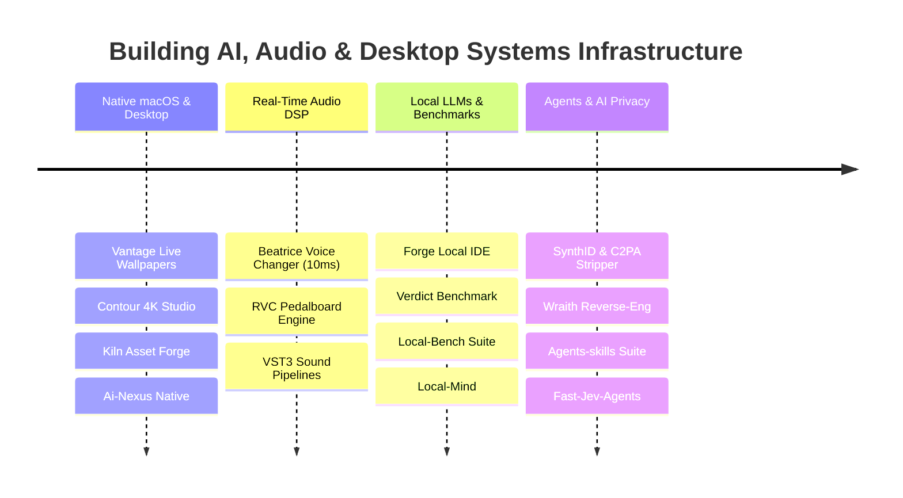

 

---

## 🧭 About me

> 🌸 **Portfolio →** [satiricalguru.vercel.app](https://satiricalguru.vercel.app/)

- 🛠️ Independent systems & AI engineer building using **AI** — an interconnected ecosystem of high-performance desktop applications, native macOS integrations, real-time DSP audio pipelines, and local AI agent architectures.
- 🌌 Shipping **[Vantage](https://github.com/satiricalguru/Vantage)** — a high-performance native live & video wallpaper engine for macOS with lock screen sync and native screen saver integration.
- 🤖 Building **[Forge](https://github.com/satiricalguru/Forge)** — a local-first, privacy-respecting AI IDE forked from VS Code optimized for offline local LLM engines (Ollama, LM Studio, llama.cpp, vLLM).
- 🔒 Creator of **[Synthid-remover](https://github.com/satiricalguru/Synthid-remover)** — 100% local pipeline removing AI watermarks, C2PA Content Credentials, and SynthID frequency signals directly on device.
- 👻 Architecting **[Wraith](https://github.com/satiricalguru/Wraith)** — a grounding-first autonomous AI reverse-engineering co-pilot for Ghidra & Cutter with an 11-signal binary parity engine.
- 🎙️ Deep in real-time voice & audio engineering — creator of **[Beatrice-voicechanger-windows](https://github.com/satiricalguru/Beatrice-voicechanger-windows)** (ultra-low latency Beatrice DSP VST3 engine), **[Beatrice-voicechanger-mac](https://github.com/satiricalguru/Beatrice-voicechanger-mac)** (10ms latency on Apple Silicon), and **[RVC-Voicechanger](https://github.com/satiricalguru/RVC-Voicechanger)** (Spotify Pedalboard DSP pipeline).
- ⚡ Creating autonomous agent infrastructure — **[Agents-skills](https://github.com/satiricalguru/Agents-skills)** (curated autonomous engineering skills), **[Agent-Swarm](https://github.com/satiricalguru/Agent-Swarm)** (LLM concurrency stress-tester), **[Fast-Jev-Agents](https://github.com/satiricalguru/Fast-Jev-Agents)** (context compaction for coding agents), and **[Verdict](https://github.com/satiricalguru/Verdict)** (AI live web & code benchmark platform).
- 🔍 Most projects start as *"let me just inspect this codebase"* and end as a full native rewrite with a shipped release.

> 🎯 **2026 Focus** — Delivering low-latency local inference tooling, modular agent swarms, and fluid native desktop experiences.

---

## 🚀 The journey so far

```mermaid
timeline
    title Building AI, Audio & Desktop Systems Infrastructure
    Native macOS & Desktop : Vantage Live Wallpapers : Contour 4K Studio : Kiln Asset Forge : Ai-Nexus Native
    Real-Time Audio DSP : Beatrice Voice Changer (10ms) : RVC Pedalboard Engine : VST3 Sound Pipelines
    Local LLMs & Benchmarks : Forge Local IDE : Verdict Benchmark : Local-Bench Suite : Local-Mind
    Agents & AI Privacy : SynthID & C2PA Stripper : Wraith Reverse-Eng : Agents-skills Suite : Fast-Jev-Agents
```

---

## 📊 Impact, live-counted

---

## 🧱 Featured builds

<table>
<tr>
<td align="center" width="50%">
<a href="https://github.com/satiricalguru/Vantage">
  <picture>
    <source media="(prefers-color-scheme: dark)" srcset="https://socialify.git.ci/satiricalguru/Vantage/image?description=1&font=Inter&language=1&name=1&owner=1&pattern=Plus&stargazers=1&theme=Dark">
    <source media="(prefers-color-scheme: light)" srcset="https://socialify.git.ci/satiricalguru/Vantage/image?description=1&font=Inter&language=1&name=1&owner=1&pattern=Plus&stargazers=1&theme=Light">
    
  </picture>
</a>
</td>
<td align="center" width="50%">
<a href="https://github.com/satiricalguru/Forge">
  <picture>
    <source media="(prefers-color-scheme: dark)" srcset="https://socialify.git.ci/satiricalguru/Forge/image?description=1&font=Inter&language=1&name=1&owner=1&pattern=Plus&stargazers=1&theme=Dark">
    <source media="(prefers-color-scheme: light)" srcset="https://socialify.git.ci/satiricalguru/Forge/image?description=1&font=Inter&language=1&name=1&owner=1&pattern=Plus&stargazers=1&theme=Light">
    
  </picture>
</a>
</td>
</tr>
<tr>
<td align="center" width="50%">
<a href="https://github.com/satiricalguru/Synthid-remover">
  <picture>
    <source media="(prefers-color-scheme: dark)" srcset="https://socialify.git.ci/satiricalguru/Synthid-remover/image?description=1&font=Inter&language=1&name=1&owner=1&pattern=Plus&stargazers=1&theme=Dark">
    <source media="(prefers-color-scheme: light)" srcset="https://socialify.git.ci/satiricalguru/Synthid-remover/image?description=1&font=Inter&language=1&name=1&owner=1&pattern=Plus&stargazers=1&theme=Light">
    
  </picture>
</a>
</td>
<td align="center" width="50%">
<a href="https://github.com/satiricalguru/Beatrice-voicechanger-windows">
  <picture>
    <source media="(prefers-color-scheme: dark)" srcset="https://socialify.git.ci/satiricalguru/Beatrice-voicechanger-windows/image?description=1&font=Inter&language=1&name=1&owner=1&pattern=Plus&stargazers=1&theme=Dark">
    <source media="(prefers-color-scheme: light)" srcset="https://socialify.git.ci/satiricalguru/Beatrice-voicechanger-windows/image?description=1&font=Inter&language=1&name=1&owner=1&pattern=Plus&stargazers=1&theme=Light">
    
  </picture>
</a>
</td>
</tr>
<tr>
<td align="center" width="50%">
<a href="https://github.com/satiricalguru/RVC-Voicechanger">
  <picture>
    <source media="(prefers-color-scheme: dark)" srcset="https://socialify.git.ci/satiricalguru/RVC-Voicechanger/image?description=1&font=Inter&language=1&name=1&owner=1&pattern=Plus&stargazers=1&theme=Dark">
    <source media="(prefers-color-scheme: light)" srcset="https://socialify.git.ci/satiricalguru/RVC-Voicechanger/image?description=1&font=Inter&language=1&name=1&owner=1&pattern=Plus&stargazers=1&theme=Light">
    
  </picture>
</a>
</td>
<td align="center" width="50%">
<a href="https://github.com/satiricalguru/Jarvis">
  <picture>
    <source media="(prefers-color-scheme: dark)" srcset="https://socialify.git.ci/satiricalguru/Jarvis/image?description=1&font=Inter&language=1&name=1&owner=1&pattern=Plus&stargazers=1&theme=Dark">
    <source media="(prefers-color-scheme: light)" srcset="https://socialify.git.ci/satiricalguru/Jarvis/image?description=1&font=Inter&language=1&name=1&owner=1&pattern=Plus&stargazers=1&theme=Light">
    
  </picture>
</a>
</td>
</tr>
<tr>
<td align="center" width="50%">
<a href="https://github.com/satiricalguru/Wraith">
  <picture>
    <source media="(prefers-color-scheme: dark)" srcset="https://socialify.git.ci/satiricalguru/Wraith/image?description=1&font=Inter&language=1&name=1&owner=1&pattern=Plus&stargazers=1&theme=Dark">
    <source media="(prefers-color-scheme: light)" srcset="https://socialify.git.ci/satiricalguru/Wraith/image?description=1&font=Inter&language=1&name=1&owner=1&pattern=Plus&stargazers=1&theme=Light">
    
  </picture>
</a>
</td>
<td align="center" width="50%">
<a href="https://github.com/satiricalguru/Agents-skills">
  <picture>
    <source media="(prefers-color-scheme: dark)" srcset="https://socialify.git.ci/satiricalguru/Agents-skills/image?description=1&font=Inter&language=1&name=1&owner=1&pattern=Plus&stargazers=1&theme=Dark">
    <source media="(prefers-color-scheme: light)" srcset="https://socialify.git.ci/satiricalguru/Agents-skills/image?description=1&font=Inter&language=1&name=1&owner=1&pattern=Plus&stargazers=1&theme=Light">
    
  </picture>
</a>
</td>
</tr>
</table>

🗂️ <b>Complete Project Matrix & Ecosystem Architecture</b>

 

| Domain | Key Projects | Focus & Technologies |
| :--- | :--- | :--- |
| 🌌 **Native macOS & Desktop Systems** | [Vantage](https://github.com/satiricalguru/Vantage) · [Contour](https://github.com/satiricalguru/Contour) · [Kiln](https://github.com/satiricalguru/Kiln) · [End4-mac](https://github.com/satiricalguru/End4-mac) · [Ai-Nexus](https://github.com/satiricalguru/Ai-Nexus) · [Pocket-Music](https://github.com/satiricalguru/Pocket-Music) · [Mac-gesture-control](https://github.com/satiricalguru/Mac-gesture-control) | High-performance native video wallpapers, 4K artwork engines, system lock screen sync, native macOS screen saver plugins, and SwiftUI desktop shells |
| 🤖 **Local AI, Benchmarks & Agent Infrastructure** | [Forge](https://github.com/satiricalguru/Forge) · [Wraith](https://github.com/satiricalguru/Wraith) · [Agents-skills](https://github.com/satiricalguru/Agents-skills) · [Verdict](https://github.com/satiricalguru/Verdict) · [Agent-Swarm](https://github.com/satiricalguru/Agent-Swarm) · [Fast-Jev-Agents](https://github.com/satiricalguru/Fast-Jev-Agents) · [Local-Bench](https://github.com/satiricalguru/Local-Bench) · [Local-Mind](https://github.com/satiricalguru/Local-Mind) · [Teardown](https://github.com/satiricalguru/Teardown) · [Aperture](https://github.com/satiricalguru/Aperture) · [Nuzzle-pets](https://github.com/satiricalguru/Nuzzle-pets) | Local-first IDEs, autonomous reverse-engineering co-pilots, agentic skill suites, live web/code arenas, context compaction, and concurrency stress-testing |
| 🎙️ **Real-Time Audio, DSP & Voice AI** | [Beatrice-voicechanger-windows](https://github.com/satiricalguru/Beatrice-voicechanger-windows) · [Beatrice-voicechanger-mac](https://github.com/satiricalguru/Beatrice-voicechanger-mac) · [RVC-Voicechanger](https://github.com/satiricalguru/RVC-Voicechanger) · [Vcclient-voicechanger](https://github.com/satiricalguru/Vcclient-voicechanger) · [PersonalAssistant](https://github.com/satiricalguru/PersonalAssistant) · [Jarvis](https://github.com/satiricalguru/Jarvis) · [EarPods-ANC-Adapter](https://github.com/satiricalguru/EarPods-ANC-Adapter) · [Podium](https://github.com/satiricalguru/Podium) | 10ms ultra-low latency voice conversion on Apple Silicon, Spotify Pedalboard DSP routing, Beatrice VST3 engines, active noise cancellation, and Three.js 3D sci-fi butler |
| 🔒 **Security, Privacy & Reverse Engineering** | [Synthid-remover](https://github.com/satiricalguru/Synthid-remover) · [DriveVault](https://github.com/satiricalguru/DriveVault) · [Mobileforce-extension](https://github.com/satiricalguru/Mobileforce-extension) · [ScrollTap](https://github.com/satiricalguru/ScrollTap) · [ShopBot](https://github.com/satiricalguru/ShopBot) · [Proofline-hackblox](https://github.com/satiricalguru/Proofline-hackblox) | Local AI watermark & C2PA content credential stripping, client-side Google Drive forensic auditing, wallet-bound verifiable credentials, and network header spoofing tools |

---

## 🧰 Tech Stack & Arsenal

 

  

<b>⚡ AI Coding Agents & Autonomous Environments</b>
  

  
  &nbsp;&nbsp;&nbsp;&nbsp;&nbsp;&nbsp;
  
  &nbsp;&nbsp;&nbsp;&nbsp;&nbsp;&nbsp;
  
  &nbsp;&nbsp;&nbsp;&nbsp;&nbsp;&nbsp;
  

  
  
  
  

---

## 🏆 GitHub Achievements

<table border="0">
<tr>
<td align="center" width="16.6%">
  <a href="https://github.com/satiricalguru?tab=achievements&achievement=galaxy-brain">
     
    <b>Galaxy Brain (Gold x4)</b> 
    Accepted Answers
  </a>
</td>
<td align="center" width="16.6%">
  <a href="https://github.com/satiricalguru?tab=achievements&achievement=pull-shark">
     
    <b>Pull Shark (Silver x3)</b> 
    Merged PRs
  </a>
</td>
<td align="center" width="16.6%">
  <a href="https://github.com/satiricalguru?tab=achievements&achievement=pair-extraordinaire">
     
    <b>Pair Extraordinaire (Gold x4)</b> 
    Co-authored Merges
  </a>
</td>
<td align="center" width="16.6%">
  <a href="https://github.com/satiricalguru?tab=achievements&achievement=starstruck">
     
    <b>Starstruck</b> 
    Popular Repository
  </a>
</td>
<td align="center" width="16.6%">
  <a href="https://github.com/satiricalguru?tab=achievements&achievement=yolo">
     
    <b>YOLO</b> 
    Merged Without Review
  </a>
</td>
<td align="center" width="16.6%">
  <a href="https://github.com/satiricalguru?tab=achievements&achievement=quickdraw">
     
    <b>Quickdraw</b> 
    Closed Within 5 Min
  </a>
</td>
</tr>
</table>

---

## 📈 Stats & Activity

<table>
<tr>
<td align="center" width="50%">

</td>
<td align="center" width="50%">

</td>
</tr>
<tr>
<td align="center" colspan="2">

</td>
</tr>
</table>

---

## 🐍 Contribution Snake

<picture>
  <source media="(prefers-color-scheme: dark)" srcset="https://raw.githubusercontent.com/satiricalguru/satiricalguru/output/github-contribution-grid-snake-dark.svg">
  <source media="(prefers-color-scheme: light)" srcset="https://raw.githubusercontent.com/satiricalguru/satiricalguru/output/github-contribution-grid-snake.svg">
  
</picture>

  

*"Building high-performance native software, advancing local AI privacy, and automating complex engineering workflows."*

